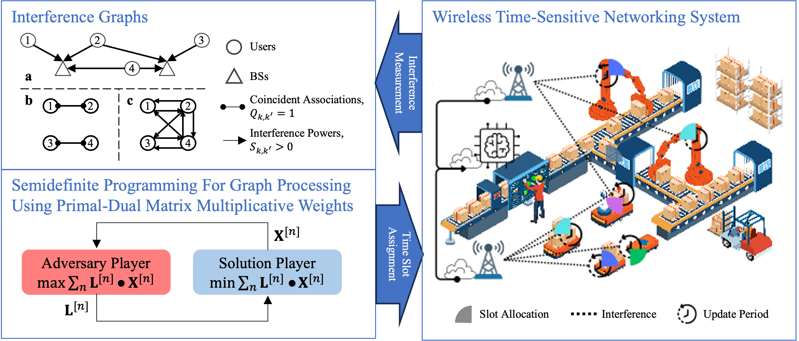

# SIG-SDP-MMW

本仓库包含两部分内容：

1. 原始 SIG-SDP/MMW 论文代码
2. 在此基础上扩展出的 WiFi/BLE 混合调度、宏周期导出、事件级绘图和 BLE hopping 实验代码

论文链接：
- [SIG-SDP: Sparse Interference Graph-Aided Semidefinite Programming for Large-Scale Wireless Time-Sensitive Networking](https://arxiv.org/pdf/2501.11307)



## 1. 环境

推荐直接使用现有 conda 环境：

```bash
source /data/home/public/anaconda3/etc/profile.d/conda.sh
conda activate sig-sdp
cd /data/home/Jie_Wan/mycode/sig-sdp-mmw-test
```

如果你要重新安装依赖：

```bash
pip install -r requirements.txt
```

说明：
- `cvxpy` 用于 BLE-only 宏周期 hopping SDP 路径
- 当前主实验脚本默认仍可在 `legacy` BLE backend 下运行

## 2. 主要入口

### 2.1 混合 WiFi/BLE 主脚本

主入口：
- `sim_script/pd_mmw_template_ap_stats.py`

这个脚本负责：
- 随机或手工生成用户对参数
- 运行 MMW / binary search 可行性流程
- 进行宏周期起始时隙分配
- 导出 CSV
- 生成 WiFi/BLE 时频调度图

### 2.2 BLE-only 宏周期 hopping SDP 原型

原型脚本：
- `ble_macrocycle_hopping_sdp.py`

这个脚本负责：
- 枚举 BLE candidate state `(offset, pattern)`
- 计算候选状态间碰撞代价矩阵
- 解 SDP 松弛并 rounding
- 输出 BLE 事件级时频块和调度图

现在主脚本已经可以通过配置把这个 BLE-only 后端接入现有调度链路，同时保留原 `legacy` 方案。

## 2.3 BLE-only GA standalone backend

`ble_macrocycle_hopping_sdp.py` 现在还支持一个独立的遗传算法后端 `ga`。它保留了与 SDP 路径相同的 candidate-state 建模方式，但把“每个 BLE pair 选择哪个 `(offset, pattern)` 组合”改成了进化搜索，因此更适合高密度实例下的快速近似求解。

可直接运行的命令：

```bash
python ble_macrocycle_hopping_sdp.py --solver ga
python ble_macrocycle_hopping_sdp.py --config ble_macrocycle_hopping_sdp_config.json
```

如果你想显式控制求解器，也可以在 JSON 里设置：

```json
{
  "solver": "ga"
}
```

#### 2.3.1 编码方式

standalone GA 不会直接在全局状态索引上做搜索，而是先把候选状态按 BLE pair 分组。代码中的 `PairCandidateGroup` 表示：
- 一个 `pair_id`
- 该 pair 的局部候选状态列表

因此，染色体的定义是：
- 染色体长度等于 BLE pair 数量
- 第 `k` 个基因只在第 `k` 个 pair 的局部候选状态集合中取值
- 一个候选状态就是一个 `(offset, pattern)` 组合

这种编码有两个好处：
- 天然满足“每个 BLE pair 恰好选一个状态”的离散约束，不需要额外 repair
- 染色体空间按 pair 局部化后，更适合在高密度实例下快速采样和变异

#### 2.3.2 适应度定义

GA 的适应度是一个越小越好的代价函数：
- `fitness = BLE-BLE collision cost + external interference cost`

其中：
- `BLE-BLE collision cost` 复用 standalone 求解器里现成的碰撞统计函数
- `external interference cost` 用来刻画候选 BLE 轨迹与外部 WiFi 干扰块的重叠

也就是说，GA 优化的不是抽象分数，而是和 SDP 路径尽量一致的物理冲突代价。这样可以保证两种 backend 虽然求解方法不同，但目标语义是对齐的。

#### 2.3.3 进化算子

当前实现采用的是一组很克制、但足够稳定的基本算子：
- `population initialization`：每个基因都只在本 pair 的局部候选中随机采样
- `tournament selection`：从当前种群中抽取少量个体，选择适应度更好的染色体作为父代
- `single-point crossover`：对两个父代做单点交叉
- `mutation`：仅在当前 pair 的局部候选集合内重新采样，不会越界到别的 pair
- `elitism`：每代保留 `elite_count` 个最优染色体，避免当前最好解退化

实现里还会记录 `fitness_history`，所以后续如果你想画收敛曲线，数据已经在 GA 结果对象里了。

#### 2.3.4 为什么在高密度场景下比 SDP 更快

GA 更快的根本原因不是单次碰撞计算更简单，而是它避免了：
- 构造和求解 lifted SDP 松弛矩阵
- 在大候选状态空间上引入 `A x A` 规模的半正定变量
- `cvxpy + solver` 在高密度配置下的编译和收敛开销

因此它的定位是：
- `SDP`：更强的优化基线，适合 small/medium scale 和研究性对比
- `GA`：高密度 BLE 下更可运行的近似搜索器，允许牺牲全局最优性换取速度和规模能力

适合调参的字段有：
- `ga_population_size`：种群规模，越大越稳但越慢
- `ga_generations`：进化代数，越大越容易收敛但越慢
- `ga_mutation_rate`：变异概率，过低容易早熟，过高会破坏收敛
- `ga_crossover_rate`：交叉概率
- `ga_elite_count`：每代保留的精英个体数
- `ga_seed`：固定随机种子，便于复现实验

这个 backend 的定位是“standalone 快速近似求解器”，不是 SDP 的严格替代；它的价值在于高密度实例下能更快给出可用调度。

## 3. 调度策略算法

### 3.1 主流程

主脚本 [pd_mmw_template_ap_stats.py](/data/home/Jie_Wan/mycode/sig-sdp-mmw-test/sim_script/pd_mmw_template_ap_stats.py) 的调度流程可以概括成 5 步：

1. 生成或读取用户对参数  
   支持 `random` 和 `manual` 两种模式。`manual` 模式下可以直接在 JSON 中给出每个 pair 的无线制式、时间窗口、信道和业务参数。

2. 构造环境与干扰关系  
   [env.py](/data/home/Jie_Wan/mycode/sig-sdp-mmw-test/sim_src/env/env.py) 负责：
   - 生成 WiFi/BLE pair
   - 设置每个 pair 的时序参数
   - 计算链路损耗、最小 SINR、时频占用
   - 维护 WiFi 固定 1/6/11 与 BLE data channel / advertising channel 的频谱语义

3. 可行性求解  
   主干求解来自原始 SIG-SDP/MMW 流程：
   - [mmw.py](/data/home/Jie_Wan/mycode/sig-sdp-mmw-test/sim_src/alg/mmw.py)
   - [binary_search_relaxation.py](/data/home/Jie_Wan/mycode/sig-sdp-mmw-test/sim_src/alg/binary_search_relaxation.py)

   这里先决定哪些 pair 能进入宏周期调度，以及对应的连续松弛结果。

4. 宏周期调度  
   对可行 pair 做起始时隙分配，得到 `schedule_slot`，再导出 `pair_parameters.csv`、`wifi_ble_schedule.csv` 和绘图中间表。

5. BLE 信道调度  
   这里有三条后端：
   - `legacy`
   - `macrocycle_hopping_sdp`
   - `macrocycle_hopping_ga`

### 3.2 `legacy` BLE 后端

`legacy` 是当前主脚本里保留的原有 BLE 调度方式。

- 如果 `ble_channel_mode = single`，每个 BLE pair 使用一个固定数据信道。
- 如果 `ble_channel_mode = per_ce`，每个 BLE 连接事件单独分配信道，最终写到 `pair_ble_ce_channels`。
- 该模式更贴近原始主脚本的事件展开和绘图链路，速度更稳定，适合大批量随机实验。

### 3.3 `macrocycle_hopping_sdp` BLE 后端

当 `ble_schedule_backend = macrocycle_hopping_sdp` 时，主脚本会调用 [ble_macrocycle_hopping_sdp.py](/data/home/Jie_Wan/mycode/sig-sdp-mmw-test/ble_macrocycle_hopping_sdp.py) 的 BLE-only 宏周期跳频调度器。

当 `wifi_first_ble_scheduling = true` 时，主脚本会先按 WiFi-first 规则得到已调度 WiFi pair 的 `(slot, freq range)` 占用，再把这些占用展开成外部干扰块 `ExternalInterferenceBlock`，送入 BLE-only hopping SDP。这样 BLE 候选 state 会优先选取未被已调度 WiFi 占用的时频资源块；如果某个 BLE pair 至少存在一个零 WiFi 重叠的 candidate state，那么所有与 WiFi 重叠的 candidate state 会被直接禁止。

下面把它按论文里的 Problem Formulation 风格整理。

#### 3.3.1 问题定义

设 BLE pair 集合为 $\mathcal{K}$，其中 $k \in \mathcal{K}$ 表示第 $k$ 个 BLE pair。  
对每个 pair，已知：

- $r_k$：release time
- $D_k$：deadline
- $\Delta_k$：connect interval
- $d_k$：单个 connection event, CE 的持续时长
- $M_k$：宏周期内 CE 数量
- $\mathcal{L}_k$：候选 hopping pattern 集

在当前实现中，一个候选 pattern $\ell \in \mathcal{L}_k$ 由：
- $c_{k,0}^{(\ell)}$：起始 data channel
- $h_k^{(\ell)}$：hop increment

共同描述。

我们的目标是：  
对每个 BLE pair 选择一个宏周期偏移 $s$ 和一个 hopping pattern $\ell$，使所有 pair 在宏周期内的总时频碰撞代价最小。

#### 3.3.2 符号与可行 offset 集

对每个 pair $k$，其可行 offset 集定义为：

```math
\mathcal{S}_k = \{ s \mid r_k \le s \le D_k - (M_k - 1)\Delta_k - d_k + 1 \}
```

该式保证最后一个 CE 仍能在 `deadline` 前结束。

给定 offset $s \in \mathcal{S}_k$，第 $m$ 个 CE 的开始时间为：

```math
t_{k,m}(s) = s + m \Delta_k, \quad m = 0,1,\dots,M_k-1
```

对应的时间占用区间为：

```math
I_{k,m}(s) = [t_{k,m}(s),\; t_{k,m}(s) + d_k - 1]
```

#### 3.3.3 Hopping 轨迹与 data channel 语义

当前程序采用一个简化但可运行的 hopping 规则：

```math
c_{k,m}^{(\ell)} = (c_{k,0}^{(\ell)} + h_k^{(\ell)} m) \bmod 37
```

这里的 `37` 对应 BLE 的 `37` 个 data channel，而不是包含广播信道的全集。

频率映射与主仿真环境保持一致：

- `0..10 -> 2404 + 2k MHz`
- `11..36 -> 2428 + 2(k-11) MHz`

因此：
- `2402 MHz`
- `2426 MHz`
- `2480 MHz`

这三个 BLE 广播信道不进入 `macrocycle_hopping_sdp` 的 hopping 空间，standalone BLE-only 图里也不会把它们画成可被 data CE 占用的资源块。

#### 3.3.4 Candidate state 定义

对每个 pair $k$，定义 candidate state：

```math
a = (k, s, \ell), \quad s \in \mathcal{S}_k,\; \ell \in \mathcal{L}_k
```

记第 $k$ 个 pair 的候选状态全集为：

```math
\mathcal{A}_k = \{ (k, s, \ell) \mid s \in \mathcal{S}_k,\; \ell \in \mathcal{L}_k \}
```

整个系统的候选状态总集合为：

```math
\mathcal{A} = \bigcup_{k \in \mathcal{K}} \mathcal{A}_k
```

程序里的 `CandidateState(pair_id, offset, pattern_id)` 就是该定义的离散实现。

#### 3.3.5 碰撞代价矩阵 $\Omega$

对任意两个 candidate state

```math
a = (k, s, \ell), \quad b = (j, s', \ell')
```

定义 CE 级碰撞代价为：

```math
\Omega_{ab}
= \sum_{m=0}^{M_k-1} \sum_{n=0}^{M_j-1}
  w_{k,j}\;
  \mathbf{1}\{ c_{k,m}^{(\ell)} = c_{j,n}^{(\ell')} \}\;
  | I_{k,m}(s) \cap I_{j,n}(s') |
```

其中：
- `w_{k,j}` 是 pair 间权重
- $\mathbf{1}\{\cdot\}$ 是同信道指示函数
- $| I_{k,m}(s) \cap I_{j,n}(s') |$ 是两个闭区间的重叠长度

代码中的 $\Omega$ 就是对所有 candidate state 两两预计算得到的碰撞矩阵。

若 WiFi 已先完成调度，还会额外构造外部干扰块集合 $\mathcal{W}$。对任一 candidate state $a$，定义其 WiFi 外部干扰代价：

```math
\Gamma_a = \sum_{b \in \mathcal{W}} \mathbf{1}\{ F(a) \cap F(b) \neq \varnothing \}\; | T(a) \cap T(b) |
```

其中 $T(a)$ 和 $F(a)$ 分别表示 candidate state $a$ 在宏周期展开后的时间占用与频谱占用。当前实现里，$\Gamma_a$ 会以对角代价的形式并入 SDP 目标；并且只要某个 BLE pair 仍存在 $\Gamma_a = 0$ 的候选状态，就会把同一 pair 内所有 $\Gamma_a > 0$ 的候选状态直接禁止。

#### 3.3.6 离散优化与 lifted SDP 松弛

如果直接做离散选择，可以写成：

```math
\min \sum_{a < b} \Omega_{ab} y_a y_b
```

其中 $y_a \in \{0,1\}$ 表示是否选择 candidate state $a$。

约束为每个 pair 必须且只能选一个状态：

```math
\sum_{a \in \mathcal{A}_k} y_a = 1, \quad \forall k \in \mathcal{K}
```

程序中采用的是 lifted SDP 松弛，令 $Y$ 为对称矩阵变量，并最小化：

```math
\min \sum_{a < b} \Omega_{ab} Y_{ab} + \sum_a \Gamma_a Y_{aa}
```

满足：

```math
\sum_{a \in \mathcal{A}_k} Y_{aa} = 1, \quad \forall k \in \mathcal{K}
```

```math
Y_{ab} = 0, \quad \forall a \ne b,\; a,b \in \mathcal{A}_k
```

```math
Y \succeq 0
```

若设置硬碰撞阈值 $\eta$，还可加：

```math
\Omega_{ab} > \eta \Rightarrow Y_{ab} = 0
```

这正是 [ble_macrocycle_hopping_sdp.py](/data/home/Jie_Wan/mycode/sig-sdp-mmw-test/ble_macrocycle_hopping_sdp.py) 里 `build_sdp_relaxation()` 的数学含义。

#### 3.3.7 Rounding 与实现假设

SDP 解得到的是松弛矩阵 $Y$，当前实现使用 $\mathrm{diag}(Y)$ 做简单 rounding：

- 对每个 pair $k$
- 在 $\mathcal{A}_k$ 中选择 $Y_{aa}$ 最大的 candidate state $a$

它不是最强的 rounding 方法，但足够适合当前的 prototype / experimental workflow。

实现层面还需要注意两点：

1. 当前 BLE-only 脚本中的 hopping 规则是实验性简化模型，不是 BLE Core Spec 的完整 channel selection algorithm。  
2. 其频谱语义已经和主仿真脚本对齐：只在 37 个 BLE data channel 上 hopping，不触碰 BLE 广播信道。

对应的程序步骤可以概括成：

1. 对每个 BLE pair 构造 candidate state `(pair_id, offset, pattern_id)`
2. 预计算碰撞矩阵 $\Omega$
3. 解 lifted SDP 松弛
4. 用 $\mathrm{diag}(Y)$ 做 rounding
5. 把选中状态展开成事件级时频块，并输出图像

这个后端更适合：
- 研究 BLE-only hopping 规则
- 对比不同 BLE pattern 的碰撞代价
- 做 small/medium scale 的宏周期跳频实验

这个后端不适合：
- 不加约束直接跑很宽的 BLE 时间窗口
- 候选 offset 和 pattern 过多的超大实例

### 3.4 `macrocycle_hopping_ga` BLE 后端

当 `ble_schedule_backend = macrocycle_hopping_ga` 时，主脚本会复用与 `macrocycle_hopping_sdp` 相同的 BLE 输入建模：
- 从 `env` 中抽取每个 BLE pair 的 `release_time / deadline / ci / ce`
- 构造相同的 candidate state `(pair_id, offset, pattern_id)`
- 在同样的 `37` 个 BLE data channel 语义下展开事件级资源块

差别只在求解器本身：
- `macrocycle_hopping_sdp` 调用 SDP 松弛 + rounding
- `macrocycle_hopping_ga` 调用 [ble_macrocycle_hopping_ga.py](/data/home/Jie_Wan/mycode/sig-sdp-mmw-test/ble_macrocycle_hopping_ga.py) 中的遗传算法搜索器

#### 3.4.1 主脚本里的 GA 设计

主脚本接入 GA 后端时，仍然保持了现有调度链路的边界不变：
1. 先由主脚本/环境生成 BLE pair 的时间窗口和时序参数
2. 调用 GA backend 选出每个 BLE pair 的 `(offset, pattern)`
3. 把结果写回 `pair_ble_ce_channels`
4. 复用现有 CSV、冲突判定和绘图链路输出最终调度结果

这意味着 `macrocycle_hopping_ga` 是一个真正的“可替换 BLE backend”，而不是旁路实验脚本。

#### 3.4.2 与 WiFi-first 的关系

当 `wifi_first_ble_scheduling = true` 时，主脚本会先把已调度 WiFi 的 `(slot, freq range)` 展开成 `ExternalInterferenceBlock`，然后把这些干扰块传给 GA backend。这样 GA 的 fitness 会优先惩罚与已占用 WiFi 时频块重叠的 BLE 候选状态。

因此，GA 并不是盲目搜索 BLE hopping，而是在已有 WiFi 占用背景下做近似避让。

#### 3.4.3 适用场景

`macrocycle_hopping_ga` 更适合：
- 高密度 BLE 场景
- 候选 offset 和 pattern 数量较多，SDP 很慢的场景
- 需要快速做参数扫描、重复试验和大规模近似比较的场景

它不适合：
- 把“最优性证明”作为第一优先级的实验
- 需要直接把 SDP 目标值当作理论对照的分析

### 3.4 BLE `ble_timing_mode`

在 `manual` JSON 模式下，BLE pair 现在支持两种 timing 输入：

- `ble_timing_mode = manual`
  你手工给出 `ble_ci_slots` 和 `ble_ce_slots`

- `ble_timing_mode = auto`
  脚本按 `seed` 自动生成 BLE 的 `ci/ce`

`auto` 模式的特点：
- 复用环境里的 BLE timing 采样逻辑
- 结果可复现
- 不需要在 JSON 里手填 `ble_ci_slots` 和 `ble_ce_slots`
- 如果不传 JSON，整个脚本仍然保持旧的随机用户对生成和调度方式

## 4. 常用运行方式

### 4.1 随机生成 WiFi/BLE 用户对

```bash
python sim_script/pd_mmw_template_ap_stats.py \
  --cell-size 1 \
  --pair-density 0.05 \
  --seed 123 \
  --mmw-nit 5 \
  --output-dir sim_script/output
```

### 4.2 读取手工 JSON 配置

```bash
python sim_script/pd_mmw_template_ap_stats.py \
  --config sim_script/pd_mmw_template_ap_stats_manual_pairs_config.json
```

### 4.3 使用 BLE `per_ce` 事件级信道模式

```bash
python sim_script/pd_mmw_template_ap_stats.py \
  --cell-size 1 \
  --pair-density 0.05 \
  --seed 123 \
  --mmw-nit 5 \
  --ble-channel-mode per_ce \
  --output-dir sim_script/output
```

### 4.4 使用 BLE-only 宏周期 hopping SDP 后端

快速 smoke 配置：

```bash
python sim_script/pd_mmw_template_ap_stats.py \
  --config sim_script/pd_mmw_template_ap_stats_macrocycle_hopping_empty_config.json
```

说明：
- `pd_mmw_template_ap_stats_macrocycle_hopping_empty_config.json` 现在是真正的空实例，`pair_density = 0.0`
- 用途是快速验证 `macrocycle_hopping_sdp` 后端入口，不用于性能测试

显式 CLI 覆盖：

```bash
python sim_script/pd_mmw_template_ap_stats.py \
  --config sim_script/pd_mmw_template_ap_stats_config.json \
  --ble-schedule-backend macrocycle_hopping_sdp
```

### 4.5 运行 9 WiFi + 16 BLE 的 auto BLE timing 示例

```bash
python sim_script/pd_mmw_template_ap_stats.py \
  --config sim_script/pd_mmw_template_ap_stats_macrocycle_hopping_9wifi_16ble.json
```

这份配置的特点：
- `9` 对 WiFi + `16` 对 BLE
- BLE 使用 `macrocycle_hopping_sdp`
- BLE 的 `ble_ci_slots` / `ble_ce_slots` 由 `seed` 自动生成
- BLE 的 `release/deadline` 已收紧到单一可行 offset，避免 SDP 状态空间爆炸

### 4.6 单独运行 BLE-only SDP 原型

```bash
python ble_macrocycle_hopping_sdp.py
```

如果要直接读取 standalone BLE-only JSON 配置，例如运行 `50` 对 BLE pair：

```bash
python ble_macrocycle_hopping_sdp.py \
  --config ble_macrocycle_hopping_sdp_config.json
```

说明：
- 不带 `--config` 时，使用脚本内置的 `4` 对 demo
- 带 `--config` 时，会读取 `ble_macrocycle_hopping_sdp_config.json` 里的 `pair_configs`、`pattern_dict`、`pair_weight`、`output_path`
- standalone 图也会额外标出 `BLE adv idle`，表示 `2402 / 2426 / 2480 MHz` 广播信道未被 data hopping 占用

## 5. 关键配置文件

### 4.1 默认随机配置

- `sim_script/pd_mmw_template_ap_stats_config.json`

用途：
- 随机生成用户对
- 当前文件默认 BLE backend 为 `macrocycle_hopping_sdp`
- 这是一个高密度随机实验入口，不是轻量 smoke 配置

### 4.2 手工用户对配置

- `sim_script/pd_mmw_template_ap_stats_manual_pairs_config.json`

用途：
- 直接手工指定 `pair_parameters`
- 当前文件已经预置了 50 对用户对，方便继续做实验修改

### 4.3 BLE hopping backend smoke 配置

- `sim_script/pd_mmw_template_ap_stats_macrocycle_hopping_empty_config.json`

用途：
- 不生成任何用户对
- 只快速验证 `macrocycle_hopping_sdp` 后端入口是否正常

### 4.4 BLE hopping backend 小规模示例

- `sim_script/pd_mmw_template_ap_stats_macrocycle_hopping_config.json`

用途：
- 提供一个很小的 hand-crafted 示例
- 适合调试配置格式

### 4.5 BLE hopping backend 大规模混合示例

- `sim_script/pd_mmw_template_ap_stats_macrocycle_hopping_9wifi_16ble.json`

用途：
- 提供 `9` 对 WiFi + `16` 对 BLE 的 mixed 实验
- BLE 使用 `macrocycle_hopping_sdp` 后端
- BLE 的 `ble_ci_slots` 和 `ble_ce_slots` 由 `seed` 自动生成，不再在 JSON 里手填
- 适合作为大规模通信下的回归与性能基线

### 4.6 BLE-only standalone 50 对配置

- `ble_macrocycle_hopping_sdp_config.json`

用途：
- 直接给 `ble_macrocycle_hopping_sdp.py` 读取
- 当前文件预置 `50` 对 BLE pair
- 输出 BLE-only 宏周期 hopping 的事件级块表和调度图

## 6. 可以改哪些参数

### 6.1 随机模式

在 `pd_mmw_template_ap_stats_config.json` 或 CLI 里常改：

- `cell_size`
- `pair_density`
- `seed`
- `mmw_nit`
- `mmw_eta`
- `max_slots`
- `ble_channel_mode`
- `ble_schedule_backend`
- `ble_max_offsets_per_pair`
- `ble_log_candidate_summary`
- `ble_channel_retries`
- `wifi_first_ble_scheduling`
- `wifi_ble_coordination_mode`
- `wifi_ble_coordination_rounds`
- `wifi_ble_coordination_top_k_wifi_pairs`
- `wifi_ble_coordination_candidate_start_limit`
- `output_dir`

### 6.2 manual 模式

在 `pair_parameters` 里可逐对修改：

- `pair_id`
- `office_id`
- `radio`
- `channel`
- `priority`
- `release_time_slot`
- `deadline_slot`
- `start_time_slot`
- `wifi_anchor_slot`
- `wifi_period_slots`
- `wifi_tx_slots`
- `ble_anchor_slot`
- `ble_timing_mode`
- `ble_ci_slots`
- `ble_ce_slots`
- `ble_ce_channels`

规则：
- WiFi 信道只能填 `0/5/10`
- BLE 数据信道只能填 `0..36`
- `pair_id` 必须从 `0` 连续编号
- 如果 BLE 使用 `macrocycle_hopping_sdp`，`release_time_slot` 和 `deadline_slot` 会直接影响可行 offset 数量；窗口过宽会显著拖慢 SDP
- `ble_timing_mode = auto` 时，manual JSON 里的 BLE pair 会按 `seed` 自动生成 `ble_ci_slots` 和 `ble_ce_slots`，并复用环境中的 BLE 时序采样逻辑
- `ble_timing_mode = auto` 时不需要手写 `ble_ci_slots` 和 `ble_ce_slots`
- 完全不传 JSON 时，脚本仍保持旧的随机生成模式
- `ble_max_offsets_per_pair` 可以对每个 BLE pair 的可行 offset 做确定性剪枝，直接减小 `|A|`
- `ble_log_candidate_summary = true` 时，BLE backend 会在求解前打印每个 pair 的 `offset_count`、`pattern_count` 和全局 `state_count`

### 6.3 输入参数与优化变量

为避免将“实验输入”与“调度器决策变量”混淆，当前模型中的量统一分为输入参数（Inputs）与优化变量（Decision Variables）两类。前者描述场景、业务需求与先验约束；后者描述求解器在可行域中真正搜索并决定的量。

#### 输入参数（Inputs）

主调度脚本 [pd_mmw_template_ap_stats.py](/data/home/Jie_Wan/mycode/sig-sdp-mmw-test/sim_script/pd_mmw_template_ap_stats.py) 的顶层输入可记为：

```math
\Theta_{\mathrm{main}} =
\{
\texttt{cell\_size},\,
\texttt{pair\_density},\,
\texttt{seed},\,
\texttt{pair\_generation\_mode},\,
\texttt{pair\_parameters},\,
\texttt{ble\_schedule\_backend},\,
\texttt{wifi\_first\_ble\_scheduling}
\}.
```

其中：
- `cell_size`、`pair_density`、`seed` 决定随机实例规模与分布；
- `pair_generation_mode` 与 `pair_parameters` 决定 pair 是随机生成还是手工给定；
- `ble_schedule_backend` 指定 BLE 路径使用 `legacy`、`macrocycle_hopping_sdp` 或 `macrocycle_hopping_ga`；
- `wifi_first_ble_scheduling` 指定是否采用先放置 WiFi 再协调 BLE 的主流程。

对第 `k` 个业务对，其已知输入可以形式化写为：

```math
\theta_k =
\left(
r_k,\,
D_k,\,
\rho_k,\,
\pi_k,\,
\chi_k
\right),
```

其中：
- `r_k` 与 `D_k` 分别表示 release time 与 deadline；
- `\rho_k \in \{\mathrm{WiFi}, \mathrm{BLE}\}` 表示业务类型；
- `\pi_k` 表示介质相关的周期参数集合；
- `\chi_k` 表示可选信道、初始偏好、office 位置等先验信息。

若 `\rho_k = \mathrm{WiFi}`，则 `\pi_k` 主要由 `wifi_tx_slots`、`wifi_period_slots`、`wifi_anchor_slot` 构成；若 `\rho_k = \mathrm{BLE}`，则 `\pi_k` 主要由 `ble_ce_slots`、`ble_ci_slots`、`ble_anchor_slot`、`ble_timing_mode` 构成。

BLE-only 宏周期跳频求解器 [ble_macrocycle_hopping_sdp.py](/data/home/Jie_Wan/mycode/sig-sdp-mmw-test/ble_macrocycle_hopping_sdp.py) 的输入参数可记为：

```math
\Theta_{\mathrm{ble}} =
\{
\texttt{num\_channels},\,
\texttt{pair\_configs},\,
\texttt{pattern\_dict},\,
\texttt{pair\_weight},\,
\texttt{hard\_collision\_threshold}
\}.
```

这里 `pair_configs` 决定每个 BLE pair 的时间窗与周期流参数，`pattern_dict` 给出每个 pair 的 hopping pattern 候选集合，`pair_weight` 给出链路对碰撞权重，`hard_collision_threshold` 用于可选的硬碰撞裁剪。

联合调度模型（joint scheduler）的实例输入则由 WiFi/BLE 任务集合、它们的时间窗、周期流参数、可选信道集合以及保护性的 WiFi baseline floor 共同给出。

#### 优化变量（Decision Variables）

在主调度脚本与联合调度模型里，真正由优化器决定的是“是否调度、何时开始、选择哪个候选状态、最终使用哪种介质/信道轨迹”。形式化地，对任务 `k` 定义：

```math
x_k \in \{0,1\},
\qquad
s_k \in \mathcal{S}_k,
\qquad
r_k \in \{\mathrm{WiFi}, \mathrm{BLE}\}.
```

其中：
- `x_k = 1` 表示任务 `k` 被成功调度；
- `s_k` 表示任务的起始 offset；
- `r_k` 表示最终选中的无线介质。

若任务 `k` 选择 BLE，则跳频相关优化变量可进一步写为：

```math
\ell_k \in \mathcal{L}_k,
\qquad
c_{k,m},\; m = 0, 1, \dots, M_k - 1,
```

其中 `\ell_k` 是 hopping pattern 编号，`c_{k,m}` 是第 `m` 个 BLE connect event 的数据信道。因此在 BLE-only SDP/GA 中，求解器真正要选的是 `(s_k, \ell_k)`，并由此恢复整条 `c_{k,m}` 跳频轨迹。

若任务 `k` 选择 WiFi，则优化器决定的是 WiFi 周期流 state，即其起始 offset、周期展开位置以及所选信道。WiFi 在 faithful 联合模型中不是单次宽块，而是沿宏周期重复展开的周期流。

在 lifted SDP 里，这些离散选择会被编码到矩阵变量中：

```math
Y \succeq 0,
```

而在 GA/HGA 中，这些离散选择则被编码为染色体中的 state index；每个基因对应一个 pair 或 task 在候选状态集合中的选取结果。

#### 为什么必须区分这两类量

输入参数描述“任务需求与场景约束”，优化变量描述“调度器实际搜索和决定的量”。例如，deadline、payload、CI/CE 候选、WiFi 周期参数属于输入；offset、pattern、每个 event 的信道序列、是否接纳某个任务则属于优化器输出。对论文表达而言，这个区分能避免把“实验给定条件”和“算法可调决策”混为一谈。

### 6.4 WiFi-BLE 迭代协调变量

除 BLE backend 自身的参数外，主线 `sim_script/pd_mmw_template_ap_stats.py` 还提供了一组控制 WiFi-first 局部协调强度的变量：

```math
\Theta_{\mathrm{coord}} =
\{
\texttt{wifi\_ble\_coordination\_mode},\,
\texttt{wifi\_ble\_coordination\_rounds},\,
\texttt{wifi\_ble\_coordination\_top\_k\_wifi\_pairs},\,
\texttt{wifi\_ble\_coordination\_candidate\_start\_limit}
\}.
```

其中：
- `wifi_ble_coordination_mode = off | iterative` 控制是否在 WiFi-first 基线之后启用局部迭代协调；
- `wifi_ble_coordination_rounds` 控制最多执行多少轮局部重排；
- `wifi_ble_coordination_top_k_wifi_pairs` 控制每轮最多分析多少个“最阻塞 BLE 的关键 WiFi pair”；
- `wifi_ble_coordination_candidate_start_limit` 控制每个关键 WiFi pair 每轮最多尝试多少个替代起始时隙。

这组变量不改变业务输入本身，而是改变 WiFi-first 主流程中的局部搜索预算。当前实现对每个候选重排都施加硬约束：

```math
N_{\mathrm{wifi}}(x') \ge N_{\mathrm{wifi}}(x^{\mathrm{base}})
```

也就是说，局部重排只允许在“不降低已调度 WiFi 数量”的前提下尝试释放更多 BLE 可行空间。这也是 `output_ga_wifi_reschedule/` 那组启发式实验的主线控制逻辑。

## 7. 当前信道建模

### 6.1 WiFi

当前场景中，WiFi 用户对只允许占用固定 3 个 20 MHz 信道：

- `channel 0` 对应中心频率 `2412 MHz`
- `channel 5` 对应中心频率 `2437 MHz`
- `channel 10` 对应中心频率 `2462 MHz`

### 6.2 BLE

BLE 数据链路使用 37 个 data channel，每个信道带宽 2 MHz。

中心频率映射为两段：

- `0..10 -> 2404 + 2*k MHz`
- `11..36 -> 2428 + 2*(k-11) MHz`

BLE 广播信道保留为：

- `2402 MHz`
- `2426 MHz`
- `2480 MHz`

在调度图里，这 3 条广播信道会以 `BLE adv idle` 灰带显示。

## 8. 输出结果

主脚本常见输出在 `output_dir` 下：

- `pair_parameters.csv`
  - 每个 pair 的参数和调度结果
- `wifi_ble_schedule.csv`
  - 时隙级汇总
- `unscheduled_pairs.csv`
  - 未调度用户对
- `schedule_plot_rows.csv`
  - 时频绘图中间表
- `ble_ce_channel_events.csv`
  - `per_ce` 模式下 BLE 事件级信道表
- `wifi_ble_schedule.png`
  - 兼容旧命名的调度图
- `wifi_ble_schedule_overview.png`
  - 整体时频图
- `wifi_ble_schedule_window_*.png`
  - 分窗口时频图

BLE-only SDP 原型会输出：

- `ble_macrocycle_hopping_sdp_schedule.png`

## 9. 性能说明

`ble_macrocycle_hopping_sdp.py` 的 SDP 目标已经改成向量化形式，能减少 CVXPY 在 Python 侧构造和编译目标函数的开销。

同时，主脚本的 BLE backend 现在支持候选状态剪枝：
- `ble_max_offsets_per_pair` 控制每个 pair 最多保留多少个可行 offset
- `ble_log_candidate_summary` 用来输出候选空间摘要，帮助定位是哪几个 pair 把 `|A|` 撑大了

这会改善：
- `Objective contains too many subexpressions` 这类警告对应的编译时间
- 小到中等规模实例的启动时间

这不会从根本上改变：
- SDP 的矩阵维度
- SCS 求解器本身的收敛时间

当前最影响 `macrocycle_hopping_sdp` 速度的因素是 BLE 候选状态总数，也就是：
- 每对 BLE 的可行 `offset` 数量
- 每对 BLE 的 hopping pattern 数量
- BLE pair 总数

当前代码已经提供两个直接可用的手段：
- `ble_max_offsets_per_pair`
  - 对每个 BLE pair 的可行 offset 做可复现剪枝
  - 剪枝规则是保留首尾，并对中间 offset 做等间距采样
- `ble_log_candidate_summary`
  - 在求解前打印候选空间摘要
  - 能直接看到 `pair_count`、全局 `state_count`，以及每对的 `offset_count/pattern_count/state_count`

因此要明确：
- 向量化主要解决的是“CVXPY 建模/编译阶段太慢”
- 它不会把一个本来就很大的 SDP 问题变成小问题
- 如果你使用 [sim_script/pd_mmw_template_ap_stats_config.json](/data/home/Jie_Wan/mycode/sig-sdp-mmw-test/sim_script/pd_mmw_template_ap_stats_config.json) 这种高密度随机配置，即使没有子表达式告警，求解本身仍可能很慢
- 现在这份高密度配置已经默认开启 `ble_max_offsets_per_pair` 和 candidate summary 日志，但如果 `state_count` 仍然很大，瓶颈会继续落在 SDP 求解器本身

如果你要控制运行时间，优先收紧：
- `release_time_slot`
- `deadline_slot`
- `ble_ci_slots`
- `ble_ce_slots`

尤其是在 `manual` 模式下，建议先把每对 BLE 的时间窗口收紧到只保留少量可行 offset。

## 10. 大规模 mixed 实验

运行 `9` 对 WiFi + `16` 对 BLE，且 BLE 使用 `macrocycle_hopping_sdp`：

```bash
python sim_script/pd_mmw_template_ap_stats.py \
  --config sim_script/pd_mmw_template_ap_stats_macrocycle_hopping_9wifi_16ble.json
```

这份配置做了两点控制：
- WiFi 固定在 `1/6/11` 三个信道
- BLE 的 `release/deadline` 窗口被收紧，避免候选 offset 爆炸

如果你要直接测试高密度随机 BLE：

```bash
python sim_script/pd_mmw_template_ap_stats.py \
  --config sim_script/pd_mmw_template_ap_stats_config.json
```

需要注意：
- 这份配置会随机生成较多 BLE pair
- 默认就启用 `macrocycle_hopping_sdp`
- 默认也启用 `ble_log_candidate_summary`
- 默认会把 `ble_max_offsets_per_pair` 限制到较小上限，目前是 `2`
- 现在通常不会再出现 `too many subexpressions` 告警
- 但仍可能因为候选状态总数大而运行较久，甚至超过几分钟

## 11. `joint_sched/` WiFi-BLE 统一联合调度实验

为避免和现有 `WiFi-first -> BLE backend` 实验链路相互污染，仓库新增了一个完全隔离的联合调度实验目录：`joint_sched/`。

这套实验把 WiFi 和 BLE 的 candidate state 放到同一个全局状态空间里联合求解，而不是先固定 WiFi 再给 BLE 补洞。

核心文件：
- `joint_sched/joint_wifi_ble_model.py`
  - 统一数据模型、mixed candidate-state builder、统一时频 block 展开、联合 cost matrix
- `joint_sched/joint_wifi_ble_sdp.py`
  - 基于 mixed state space 的 lifted SDP relaxation + rounding
- `joint_sched/joint_wifi_ble_ga.py`
  - 优化后的基线联合 GA，支持缓存和种群种子
- `joint_sched/joint_wifi_ble_hga_model.py`
  - WiFi stripe 近似、blocker 诊断、局部联合重排辅助函数
- `joint_sched/joint_wifi_ble_hga.py`
  - 统一联合启发式 GA（HGA），在联合状态空间内做启发式种子和局部修复
- `joint_sched/joint_wifi_ble_plot.py`
  - standalone 绘图，图中会保留 BLE 广播信道 `2402/2426/2480 MHz`
- `joint_sched/run_joint_wifi_ble_demo.py`
  - standalone 运行入口
- `joint_sched/joint_wifi_ble_demo_config.json`
  - 独立 demo 配置

### 11.1 问题定义

`joint_sched/` 把 WiFi pair 和 BLE pair 统一看成任务集合 $\mathcal{K}$。每个任务 $k \in \mathcal{K}$ 给定：

- 无线介质类型 $m_k \in \{\mathrm{wifi}, \mathrm{ble}\}$
- 业务负载 $b_k$
- 最早允许开始时隙 $r_k$
- 最晚完成时隙 $D_k$

对于 WiFi 任务，候选状态还需要决定：
- 起始 offset $s_k$
- WiFi 信道 $c_k \in \{1,6,11\}$（代码里对应索引 `{0,5,10}`）
- 发送宽度 $w_k$（slot 数）
- 周期参数 $p_k$
- 宏周期内重复次数 $M_k^{\mathrm{wifi}}$

对于 BLE 任务，候选状态还需要决定：
- 起始 offset $s_k$
- 初始 data channel $c_k \in \{0,\ldots,36\}$
- hopping pattern 编号 $\ell_k$
- `CI` $\Delta_k$
- `CE` 宽度 $d_k$
- 宏周期内 event 数 $M_k$

这里的联合调度目标是：在统一宏周期内，为 WiFi 和 BLE 共同选择一组无碰撞的状态组合，并在“业务负载收益”和“时频占用代价”之间做平衡。这样求解器不会单纯为了多调度若干个窄任务，就放弃高负载但占用更宽的 WiFi 任务。

### 11.2 联合候选状态与空状态

对每个任务 $k$，构造其候选状态集合 $\mathcal{A}_k$。其中：

- WiFi 候选状态写成 $a = (k, \mathrm{wifi}, s, c, p, w, M^{\mathrm{wifi}})$
- BLE 候选状态写成 $a = (k, \mathrm{ble}, s, c, \ell, \Delta, d, M)$

除此之外，每个任务还额外加入一个空状态 $\varnothing_k$，表示该任务在本轮联合调度中不被安排。于是实际候选集合为：

```math
\tilde{\mathcal{A}}_k = \mathcal{A}_k \cup \{\varnothing_k\}
```

空状态的作用有两点：

1. 在高密度场景下，联合问题不会因为少数任务互相冲突而整体 infeasible。
2. 求解器可以在硬无碰撞约束下，显式决定哪些 pair 被调度、哪些 pair 被放入 `unscheduled_pairs.csv`。

### 11.3 统一时频块展开与硬冲突判定

对任意 candidate state $a$，都展开成一个时频资源块集合 $\mathcal{B}(a)$。

对 WiFi 状态 $a = (k, \mathrm{wifi}, s, c, p, w, M^{\mathrm{wifi}})$，其第 $m$ 个周期事件占用为：

```math
\tau_{k,m}(a) = s + mp, \qquad J_{k,m}(a) = [\tau_{k,m}(a),\, \tau_{k,m}(a) + w)
```

于是 WiFi 的资源块集合为：

```math
\mathcal{B}(a) = \bigcup_{m=0}^{M^{\mathrm{wifi}}-1} \left\{ J_{k,m}(a) \times [f_c - 10,\, f_c + 10] \right\}
```

其中 $f_c$ 是 WiFi 信道中心频率，带宽固定为 `20 MHz`。

对 BLE 状态 $a = (k, \mathrm{ble}, s, c, \ell, \Delta, d, M)$，第 $m$ 个 `CE` 的时隙区间为：

```math
t_{k,m}(a) = s + m\Delta, \qquad I_{k,m}(a) = [t_{k,m}(a),\, t_{k,m}(a) + d)
```

第 $m$ 个 `CE` 的 data channel 由 hopping rule 给出：

```math
h_{k,m}(a) = H(c, \ell, m)
```

于是 BLE 的资源块集合为：

```math
\mathcal{B}(a) = \bigcup_{m=0}^{M-1} \left\{ I_{k,m}(a) \times [f_{h_{k,m}(a)} - 1,\, f_{h_{k,m}(a)} + 1] \right\}
```

其中每个 BLE data channel 的带宽固定为 `2 MHz`，且只允许落在 `37` 个 BLE data channel 上，不允许跳到广播信道 `2402 / 2426 / 2480 MHz`。

对两个候选状态 $a$ 与 $b$，若存在任意一对资源块在时间和频率上都有正重叠，则定义它们硬冲突：

```math
\exists B_a \in \mathcal{B}(a),\; \exists B_b \in \mathcal{B}(b)
\text{ s.t. }
|B_a \cap B_b| > 0
```

代码里这一步由 `state_pair_is_feasible(...)` 和 `build_joint_forbidden_state_pairs(...)` 实现；只要发生 WiFi-WiFi、BLE-BLE 或 WiFi-BLE 的时频重叠，该状态对就被禁止共同出现。

### 11.4 联合 SDP

记全局候选状态索引集合为：

```math
\tilde{\mathcal{A}} = \bigcup_{k \in \mathcal{K}} \tilde{\mathcal{A}}_k
```

设 $n = |\tilde{\mathcal{A}}|$，并用 lifted 变量 $Y \in \mathbb{S}_+^n$ 表示 SDP 松弛。定义对角元：

```math
y_a = Y_{aa}
```

其中 $y_a$ 近似表示状态 $a$ 被选中的程度。

#### 11.4.1 一任务一状态约束

每个任务必须且只能从自己的候选集合中选一个状态（包括空状态）：

```math
\sum_{a \in \tilde{\mathcal{A}}_k} y_a = 1,
\qquad \forall k \in \mathcal{K}
```

并且：

```math
0 \le y_a \le 1, \qquad \forall a \in \tilde{\mathcal{A}}
```

#### 11.4.2 lifting 一致性约束

代码里使用了标准的 pairwise linking 约束：

```math
Y_{ab} \le y_a,
\qquad
Y_{ab} \le y_b,
\qquad
Y_{ab} \ge y_a + y_b - 1,
\qquad
Y_{ab} \ge 0
```

并且要求：

```math
Y = Y^\top, \qquad Y \succeq 0
```

#### 11.4.3 硬无碰撞约束

若状态对 $(a,b)$ 属于禁止集合 $\mathcal{F}$，即它们在统一时频块展开后发生重叠，则直接加入硬约束：

```math
Y_{ab} = 0,
\qquad \forall (a,b) \in \mathcal{F}
```

这一步保证最终 rounding 只会返回零碰撞的 WiFi/BLE 联合调度结果。

#### 11.4.4 目标函数

此前的联合目标若只奖励“调度更多 pair”，容易出现一个问题：求解器为了容纳更多窄任务，会主动放弃高负载但占用更宽的 WiFi 状态，最终导致图上虽然无碰撞，但整体频谱承载效率并不高。

因此当前 `joint_sched` 改成词典序目标：
1. 先最大化总已调度数据量
2. 在总数据量相同或足够接近时，再最小化碎片和空闲谱面积

记染色体或 rounding 后的联合解为 $x$，其总已调度数据量定义为：

```math
P(x) = \sum_{k=1}^{K} b_k \cdot \mathbf{1}[x_k \neq \varnothing_k]
```

其中 $b_k$ 是任务 $k$ 的 payload bytes，$\varnothing_k$ 表示任务未被调度。

记填充代价为：

```math
F(x) = \mu_1 \mathrm{Frag}(x) + \mu_2 \mathrm{Idle}(x) + \mu_3 \mathrm{Span}(x)
```

其中：
- $\mathrm{Frag}(x)$ 表示联合排布在时间轴上的碎片度
- $\mathrm{Idle}(x)$ 表示包络盒内部未被使用的空闲时频面积
- $\mathrm{Span}(x)$ 表示最终调度跨越的总时间范围
- $\mu_1, \mu_2, \mu_3 > 0$ 是填充阶段的惩罚系数

实现中允许一个 payload tie window $\varepsilon$。于是联合 SDP 的第二阶段可写成：

```math
x^\star = \arg\min F(x)
\quad \text{s.t.} \quad P(x) \ge P^\star - \varepsilon
```

其中 $P^\star$ 是第一阶段“最大 payload”问题的最优值。

对 lifted SDP 变量 $Y$，当前实现采用两阶段求解：

第一阶段：

```math
\max_{Y \succeq 0} \sum_{a \in \tilde{\mathcal{A}}} p_a y_a
```

其中 $p_a = b_{k(a)}$ 若状态 $a$ 为真实调度状态，否则 $p_a = 0$。

第二阶段：

```math
\min_{Y \succeq 0} \sum_{a \in \tilde{\mathcal{A}}} f_a y_a + \sum_{a<b} \Omega_{ab} Y_{ab}
```

满足：

```math
\sum_{a \in \tilde{\mathcal{A}}} p_a y_a \ge P^\star - \varepsilon
```

其中 $f_a$ 是状态级填充代价近似，代码里由每个 candidate state 的跨度、重复跳频跨度和面积代理项组成。

这样做的好处是：
- 第一阶段先把“总承载数据量”钉住
- 第二阶段只在 payload 不掉的前提下，压紧排布、降低碎片
- 不会再出现“为了多调几个小任务而主动放弃大 WiFi 负载”的目标偏差

#### 11.4.5 Protected WiFi Payload Floor

在 faithful-mainline 联合调度场景中，仅仅最大化总 payload 仍然可能出现另一种偏差：求解器会用大量窄 BLE 状态替换一部分宽 WiFi 周期流，从而使总承载看似不差，但 WiFi 服务质量明显下降。

为避免这种现象，当前联合 `GA/HGA` 额外引入受保护的 WiFi payload floor：

```math
P_{\mathrm{wifi}}(x) \ge P_{\mathrm{wifi}}^{\min}
```

其中：
- $P_{\mathrm{wifi}}(x)$ 表示联合解 $x$ 中所有已调度 WiFi 任务的 payload 总和
- $P_{\mathrm{wifi}}^{\min}$ 可以直接来自配置项 `wifi_payload_floor_bytes`
- 对 `HGA` 而言，还会进一步抬高为启发式种子解中的 WiFi payload，避免局部重排把 WiFi 越调越少

因此在 `GA/HGA` 中，候选解的比较顺序改为：

```math
\mathrm{key}(x)
=
\Big(
P_{\mathrm{wifi}}(x),
P_{\mathrm{all}}(x),
N_{\mathrm{scheduled}}(x),
-F(x)
\Big)
```

但只有满足 WiFi floor 的候选解才会进入这个词典序比较。若两个候选中一个满足：

```math
P_{\mathrm{wifi}}(x) \ge P_{\mathrm{wifi}}^{\min}
```

另一个不满足，则前者始终更优。

这样做的结果是：
- 不会再用牺牲 WiFi 周期流去换取更多 BLE pair
- 仍保持 unified joint scheduling，而不是退回到顺序式 `WiFi-first -> BLE`
- `HGA` 的局部残余谱重排也必须在 WiFi floor 之上进行

#### 11.4.6 Faithful Mainline WiFi Floor Derivation

当 `joint_sched` 直接读取主线 `pair_parameters.csv` 时，实验不再默认使用 `wifi_payload_floor_bytes = 0`。相反，适配器会先从主线已经成功调度的 WiFi pair 中恢复一个 baseline WiFi payload：

```math
P_{\mathrm{wifi}}^{\min}
=
\sum_{k \in \mathcal{K}_{\mathrm{wifi}}^{\mathrm{scheduled}}}
b_k^{\mathrm{wifi}}
```

这里：
- $\mathcal{K}_{\mathrm{wifi}}^{\mathrm{scheduled}}$ 表示主线输出里 `schedule_slot \ge 0` 的 WiFi pair 集合
- $b_k^{\mathrm{wifi}}$ 采用联合模型自身的 payload 语义，即每个 WiFi 任务的 `payload_bytes`
- 在当前 faithful 适配中，$b_k^{\mathrm{wifi}} = w_k \cdot \rho_{\mathrm{wifi}}$，其中 $w_k$ 是 `wifi_tx_slots`，$\rho_{\mathrm{wifi}}$ 是代码中的 `DEFAULT_WIFI_BYTES_PER_SLOT`

于是 faithful `joint_sched` 自动把这个值写回目标配置：

```math
P_{\mathrm{wifi}}(x) \ge P_{\mathrm{wifi}}^{\min}
```

同时，适配器还会从主线 CSV 中恢复一条 WiFi baseline seed，把已调度 WiFi 周期流映射成联合候选状态的初始染色体片段。这样 unified joint `GA/HGA` 不会从一个完全不含 WiFi 的随机种群起步，而是至少从一个满足 baseline WiFi 保护约束的联合解附近开始搜索。

#### 11.4.7 rounding

SDP 解出后，按任务逐个 rounding：
- 优先考虑对角元 $y_a$ 更大的状态
- 同时检查它与当前已选状态集合之间是否落在禁止集合 $\mathcal{F}$
- 若冲突则跳过，继续尝试该任务的下一候选
- 如果该任务的真实候选都不可用，则落到空状态 $\varnothing_k$

最终输出：
- `selected_states`：成功调度的 WiFi/BLE 状态
- `unscheduled_pair_ids`：被分配到空状态的任务

### 11.5 统一联合 GA

联合 GA 与联合 SDP 复用完全相同的混合候选状态空间 $\tilde{\mathcal{A}}_k$ 和相同的禁止状态对集合 $\mathcal{F}$。

#### 11.5.1 染色体编码

设共有 $K = |\mathcal{K}|$ 个任务，则一个染色体写成：

```math
x = (x_1, x_2, \ldots, x_K)
```

其中第 $k$ 个基因 $x_k$ 是从 $\tilde{\mathcal{A}}_k$ 中选中的状态索引。于是一个染色体同时决定了：
- 哪些 WiFi pair 被调度
- 哪些 BLE pair 被调度
- 哪些 pair 被放入空状态

#### 11.5.2 可行性

若染色体中任意两基因对应的状态对落在 $\mathcal{F}$ 中，则该染色体不可行。

```math
\exists i < j \text{ such that } (x_i, x_j) \in \mathcal{F}
\;\Rightarrow\;
\text{chromosome infeasible}
```

#### 11.5.3 适应度函数

联合 GA 不再使用单个 utility 标量直接排序，而是采用与联合 SDP 一致的词典序比较规则。

对任意染色体 $x$，先计算：

```math
P(x) = \sum_{k=1}^{K} b_k \cdot \mathbf{1}[x_k \neq \varnothing_k]
```

以及填充代价：

```math
F(x) = \mu_1 \mathrm{Frag}(x) + \mu_2 \mathrm{Idle}(x) + \mu_3 \mathrm{Span}(x)
```

再计算软代价：

```math
C(x) = \sum_{i<j} \Omega_{x_i x_j}
```

若两个染色体 $x^{(1)}$ 与 $x^{(2)}$ 对比，则当前实现按以下顺序比较：
1. 若 $P(x^{(1)}) > P(x^{(2)}) + \varepsilon$，则 $x^{(1)}$ 更优
2. 若二者 payload 落在 tie window 内，则比较 $F(x)$，填充代价更小者更优
3. 若填充代价仍相同，则比较软代价 $C(x)$

因此 GA 的本质不是“最大化调度数”，而是：
- 先保住总 payload
- 再把相同 payload 的解尽量压紧
- 最后才用软代价做细化区分

若染色体不可行，则仍直接赋予极差排名，不进入精英保留和锦标赛胜者。

#### 11.5.4 遗传操作

当前实现包含：
- 随机初始化
- tournament selection
- single-point crossover
- mutation
- elitism
- `repair_chromosome(...)`

其中 `repair` 的作用是：如果交叉或变异后出现冲突，则按基因顺序尝试替换成同任务的其它候选；若所有真实候选都冲突，则退回该任务的空状态。

因此 GA 和 SDP 一样，也能稳定地产生：
- `selected_states`
- `unscheduled_pair_ids`
- 零碰撞的最终资源块集合

#### 11.5.5 优化后的联合 GA 基线

当前基线 `joint_wifi_ble_ga.py` 已经做了两类面向大实例的优化：

- 染色体指标缓存  
  `chromosome_metrics(x)` 会按染色体元组缓存 `payload / fill_penalty / soft_cost`，避免在锦标赛选择、精英筛选和重复 repair 后反复整条重算。
- 可注入的启发式种群种子  
  `initialize_population(..., seeded_chromosomes=...)` 支持先注入外部给定的联合可行种子，再随机补齐剩余种群。后续 HGA 就基于这一入口，把更强的联合启发式初始解送入同一个联合 GA 内核。

因此当前基线 GA 和后面的 HGA 不是两套不相干的搜索器，而是：
- 一个共享同一混合状态空间
- 共享同一硬无碰撞 repair
- 共享同一词典序目标比较

的统一框架。

### 11.6 统一联合 HGA

为避免退回到“先调 WiFi，再补 BLE”的顺序式 pipeline，当前 `joint_sched` 新增的 HGA 仍然是**统一联合调度**。它不先冻结一套 WiFi 解，而是在同一个联合染色体空间里引入更强的启发信息。

HGA 的关键想法有两层：

1. WiFi stripe 近似  
   一个 `20 MHz` 的 WiFi 状态在启发诊断阶段被近似展开成 `10` 条同步的 `2 MHz` stripe：

```math
\mathcal{W}(a) = \bigcup_{q=0}^{9} \left\{ [s, s+w) \times [f_c - 10 + 2q,\; f_c - 8 + 2q] \right\}
```

这里 `stripe` 只用于估计 WiFi 对 BLE 状态的局部阻塞关系，并不改变主模型里的硬无碰撞判定；最终可行性仍然回到统一的真实时频 block 检查。

2. 联合启发式搜索  
   HGA 不是“WiFi-only seed + BLE-only patch”，而是：
   - 先构造若干**联合 greedy seed**
   - 把这些种子注入基线联合 GA
   - 再对当前最优联合染色体做 **blocker-guided local reshuffle**
   - 重新调用同一个联合 GA 内核搜索更优的统一联合解

#### 11.6.1 联合 greedy seeds

设联合染色体仍为：

```math
x = (x_1, x_2, \ldots, x_K), \qquad x_k \in \tilde{\mathcal{A}}_k
```

HGA 会先按不同任务顺序构造多个 greedy 种子，例如：
- payload 降序
- payload-density 降序
- earliest-release 顺序

对每个顺序，逐任务选择当前最优且与已选状态集合无冲突的候选；若所有真实候选都不可行，则该任务暂时落到空状态。

这些种子本身已经是**联合染色体**，而不是先有一套 WiFi 解、再有一套 BLE 解。

#### 11.6.2 Blocker-guided local reshuffle

对当前最优联合解 `x`，若仍存在未调度 BLE 任务，则 HGA 会：
- 找出这些未调度 BLE 候选与当前已选 WiFi 状态之间的 stripe-level blocker
- 统计哪些 WiFi pair 最频繁地阻塞未调度 BLE
- 仅对这些 WiFi pair 生成少量局部替代状态
- 同时把部分未调度 BLE 任务切回真实候选状态
- 形成一批新的**联合染色体种子**

记这些局部候选种子为：

```math
\mathcal{X}_{\mathrm{local}} = \{x^{(1)}, x^{(2)}, \ldots, x^{(R)}\}
```

然后把它们重新送回同一个联合 GA 搜索器：

```math
\text{GA population} \leftarrow \mathcal{X}_{\mathrm{seed}} \cup \mathcal{X}_{\mathrm{local}} \cup \mathcal{X}_{\mathrm{rand}}
```

因此 HGA 的“启发式能力”本质上是：
- 更强的联合初始化
- 更定向的局部联合扰动
- 而不是改变问题定义

#### 11.6.3 Protected WiFi floor 与 residual-hole packing

在 faithful mainline 模式下，HGA 不允许通过牺牲基线 WiFi 周期流来换取更多 BLE。设从主线已调度结果恢复出的 protected WiFi baseline 为 $\mathcal{W}_{\mathrm{base}}$，则 floor 定义为：

```math
P_{\mathrm{wifi}}^{\min} = \sum_{a \in \mathcal{W}_{\mathrm{base}}} p_a
```

其中 $p_a$ 是状态 $a$ 对应的 payload。HGA 只接受满足

```math
\sum_{a \in \mathcal{A}_{\mathrm{wifi}}} p_a x_a \ge P_{\mathrm{wifi}}^{\min}
```

的联合染色体，任何低于该 floor 的候选都会在比较阶段和最终后置检查中被拒绝。

在满足 protected WiFi floor 后，HGA 再显式提取当前解的残余谱洞。记当前已选状态集合诱导的占用集合为 $\Omega(x)$，则每个 BLE `2 MHz` data stripe 上的 residual hole 可写成：

```math
\mathcal{H}(x) = \{ h_r = [t_r^{\mathrm{start}}, t_r^{\mathrm{end}}) \times [f_r^{\mathrm{low}}, f_r^{\mathrm{high}}] \}
```

对 BLE 候选状态 $b$，HGA 计算其对 hole $h_r$ 的 fit score：

```math
\phi(b, h_r) = \frac{\mathrm{OverlapArea}(b, h_r)}{\mathrm{Area}(h_r)} - \lambda \, \mathrm{WifiOverlapArea}(b \mid x)
```

其中第一项鼓励 BLE 候选填满当前洞，第二项惩罚它重新挤压 protected WiFi 或已选状态。于是 residual seed 会优先把高 $\phi(b, h_r)$ 的 BLE 候选注入 GA 初始种群。

#### 11.6.4 Repair/Packing 阶段

当前最优联合染色体 $x^\star$ 生成后，HGA 还会做一轮受保护的 repair/packing：

1. 固定满足 WiFi floor 的已选 WiFi 子集  
2. 从残余谱洞中挑选最适合的未调度 BLE 候选  
3. 若 BLE 候选可直接插入且保持无碰撞，则执行 insertion  
4. 若不可直接插入，则只允许和少量 BLE blocker 做局部 swap，禁止删除 protected WiFi  

记 repair 后的候选解为 $\hat{x}$，则它必须满足：

```math
\sum_{a \in \mathcal{A}_{\mathrm{wifi}}} p_a \hat{x}_a \ge P_{\mathrm{wifi}}^{\min}
```

并且在词典序比较中仍以：

```math
(\text{wifi payload}, \text{total payload}, -\text{fill penalty}, \text{selected pairs})
```

排序。也就是说，repair/packing 的目标不是盲目多塞 BLE，而是在 **WiFi 不下降** 的前提下，把剩余谱里的 BLE 再尽量塞满。

#### 11.6.5 Aggressive packing 细化

为进一步逼近旧启发式中 `5 WiFi + 34 BLE` 的密排结果，当前 `joint_sched` 又在 protected repair 上加了两步：

1. **基于 residual hole 容量的直接 insertion**  
   对每个 residual hole $h_r$，优先选择 fill ratio 更高的 BLE candidate：

```math
\phi(b, h_r) = \frac{\mathrm{OverlapArea}(b, h_r)}{\mathrm{Area}(h_r)} - \lambda \mathrm{WifiOverlapArea}(b \mid x)
```

2. **多 BLE subset replacement**  
   当单个 BLE 无法直接插入时，repair 不再只尝试“一换一”，而是评估：

```math
x' = x - \mathcal{B}_{\mathrm{out}} + \mathcal{B}_{\mathrm{in}}
```

其中 $\mathcal{B}_{\mathrm{out}}$ 是一小组低收益冲突 BLE，$\mathcal{B}_{\mathrm{in}}$ 是能更紧密填充 residual hole 的 BLE 子集。这个替换仍然必须满足：

```math
\sum_{a \in \mathcal{A}_{\mathrm{wifi}}} p_a x'_a \ge P_{\mathrm{wifi}}^{\min}
```

以及零硬碰撞约束。

当前实现中，subset replacement 为了控制组合爆炸，采用了：
- 先按 residual-hole score 截断候选 BLE pool
- 再只枚举小规模子集（当前默认到 `2`）

因此这版 aggressive packing 的意义更偏“定向增强 repair 能力”，而不是无限放大局部搜索空间。

#### 11.6.3 Unified Joint GA/HGA Encoding

联合 `GA/HGA` 的正式染色体并不把一个 `20 MHz` WiFi 周期流拆成 `10` 个独立可调度任务。真实编码仍然保持“一任务一基因”：

```math
x = (a_1, a_2, \ldots, a_{|\mathcal{K}|}), \qquad a_k \in \tilde{\mathcal{A}}_k
```

其中：
- 当 $k \in \mathcal{K}^{\mathrm{wifi}}$ 时，$a_k$ 是一个完整 WiFi 周期流状态
- 当 $k \in \mathcal{K}^{\mathrm{ble}}$ 时，$a_k$ 是一个完整 BLE 跳频状态
- $\tilde{\mathcal{A}}_k = \mathcal{A}_k \cup \{\varnothing_k\}$ 包含空状态

WiFi 任务状态写成：

```math
a_k^{\mathrm{wifi}} = (c_k, s_k, T_k, w_k, M_k)
```

其中 $c_k$ 是 WiFi 信道，$s_k$ 是周期流 offset，$T_k$ 是周期，$w_k$ 是每次发送宽度，$M_k$ 是宏周期内重复次数。其占用集合为：

```math
\mathcal{B}(a_k^{\mathrm{wifi}})
=
\bigcup_{m=0}^{M_k-1}
\left(
[s_k + mT_k,\ s_k + mT_k + w_k)_{\mathrm{mod}\ H}
\times
\mathcal{F}(c_k)
\right)
```

BLE 任务状态写成：

```math
a_k^{\mathrm{ble}} = (s_k, \ell_k, \Delta_k, d_k, M_k)
```

其中 $s_k$ 是初始 offset，$\ell_k$ 是 hopping pattern，$\Delta_k$ 是 `CI`，$d_k$ 是 `CE` 宽度，$M_k$ 是事件数。其占用集合为：

```math
\mathcal{B}(a_k^{\mathrm{ble}})
=
\bigcup_{m=0}^{M_k-1}
\left(
[s_k + m\Delta_k,\ s_k + m\Delta_k + d_k)
\times
\{f_{k,m}^{(\ell_k)}\}
\right)
```

因此 unified joint `GA/HGA` 搜索的是完整的 WiFi 周期流状态和完整的 BLE 跳频状态。`10` 条 `2 MHz` WiFi stripe 只在启发式阶段作为几何感知工具使用，不会进入正式染色体编码。

#### 11.6.4 whole-WiFi-state move heuristic

为提高 BLE 对残余谱洞的利用率，当前 `HGA` 不再只在 BLE 侧做 repair，而会显式移动**整个 WiFi 周期流状态**。设当前 WiFi 状态为 $a_k^{\mathrm{wifi}}$，其可移动替代集合为：

```math
\widetilde{\mathcal{A}}_k^{\mathrm{wifi,move}}
\subseteq
\mathcal{A}_k^{\mathrm{wifi}}
```

每个 move candidate 通过改变：
- 周期流 offset
- WiFi 信道

来尝试释放更多 BLE 可行洞。为估计几何阻塞，启发式会把当前 WiFi `20 MHz` 状态临时展开成 `10` 条 `2 MHz` stripe，但这些 stripe 只是 blocker / hole-fit 评分工具，并不是 `10` 个独立任务。

对候选 WiFi move $\tilde{a}$，当前实现按“释放的 BLE pair 数量 + residual-hole 改善”排序，可抽象写成：

```math
\psi(\tilde{a}\mid x)
=
\alpha \cdot N_{\mathrm{freed}}(\tilde{a}\mid x)
- \beta \cdot \mathrm{Overlap}(\tilde{a}, \mathcal{H}(x))
+ \gamma \cdot \mathbf{1}[c(\tilde{a}) \neq c(a_k)]
```

其中：
- $N_{\mathrm{freed}}(\tilde{a}\mid x)$ 表示 move 后新释放的 BLE pair 数量
- 第二项惩罚 move 后继续压住残余谱洞的 WiFi 状态
- 第三项轻度奖励信道切换，避免只在一个局部 offset 上抖动

这些 WiFi move 不会单独决定最终解，而是会被转成新的**联合染色体种子**，再次送回同一个联合 `GA` 内核继续搜索。因此搜索语义仍然是 unified joint scheduling，而不是 `WiFi-first -> BLE`。

在当前版本里，HGA 还额外加入了一步 **direct accept-if-better WiFi local move**。这一步不再只是生成 seed，而是直接对当前 best 联合解中的某个 WiFi 周期流状态做局部替换，然后立即执行一次 BLE repack。记当前解为 $x$，替换某个 WiFi 状态后的候选解为 $x'$，则只有同时满足：

```math
P_{\mathrm{wifi}}(x') \ge P_{\mathrm{wifi}}^{\min}
```

以及

```math
\mathrm{score}(x') > \mathrm{score}(x)
```

时，WiFi local move 才会被直接接受。这里的 `score` 仍然是 protected lexicographic objective，也就是：
- 先保 WiFi payload floor
- 再比总 payload
- 再比 fill penalty
- 最后比调度 pair 数

因此这一步的作用不是“为了挪 WiFi 而挪 WiFi”，而是：
- 选一个完整的 WiFi 周期流 state
- 尝试更好的 offset / channel
- 立即在新残余谱上重排 BLE
- 如果整体联合调度确实更好，再把这个 move 纳入最终解

#### 11.6.5 Faithful Mainline Experiment Record

当前 faithful 对照实验直接读取主线旧启发式输出：

- `sim_script/output_ga_wifi_reschedule/pair_parameters.csv`

联合 `joint_sched` 会自动：
- 恢复真实 WiFi 周期流语义
- 推导 baseline WiFi payload floor
- 从已调度 WiFi 构造 protected seed states

推荐运行方式：

```bash
python joint_sched/run_joint_wifi_ble_demo.py \
  --solver hga \
  --config sim_script/output_ga_wifi_reschedule/pair_parameters.csv \
  --output joint_sched/experiments/faithful_hga_wifi_state_moves
```

输出目录会记录：
- `joint_summary.json`
- `experiment_record.md`
- `wifi_ble_schedule_overview.png`
- `wifi_ble_schedule_window_000.png`

其中 `joint_summary.json` 里最关键的 faithful 字段是：
- `wifi_seed_payload_bytes`
- `final_wifi_payload_bytes`
- `wifi_move_seed_count`
- `wifi_move_repairs_used`
- `accepted_wifi_local_moves`
- `repair_insertions_used`
- `repair_swaps_used`

#### 11.6.6 WiFi payload 守恒约束

为了不让启发式搜索通过牺牲 WiFi 大流量任务来换取少量 BLE 增益，HGA 对局部候选结果加入了 WiFi payload 下限：

```math
P_{\mathrm{wifi}}(x') \ge P_{\mathrm{wifi}}(x^{\mathrm{seed}})
```

其中：
- `x^{seed}` 是 HGA 的当前联合种子解
- `x'` 是局部重排后的新候选
- `P_wifi` 表示仅统计 WiFi 任务的已调度 payload

这一步保证 HGA 的联合改进不会通过“先掉 WiFi payload，再用 BLE 补回来”的方式作弊。

#### 11.6.7 输出字段

HGA 在 runner summary 中额外输出：
- `search_mode = "unified_joint"`
- `wifi_seed_payload_bytes`
- `final_wifi_payload_bytes`
- `coordination_rounds_used`
- `heuristic_seed_count`
- `candidate_state_count`

这些字段用于判断：
- HGA 是否真的保持了联合搜索语义
- WiFi payload 是否被守住
- 本轮改进是否主要来自启发式种子还是局部重排

### 11.7 输出文件与主线对齐

`joint_sched/` 现在会输出与主线 `sim_script/output/` 同款 artifact：

- `pair_parameters.csv`
- `wifi_ble_schedule.csv`
- `unscheduled_pairs.csv`
- `schedule_plot_rows.csv`
- `ble_ce_channel_events.csv`
- `joint_summary.json`
- `wifi_ble_schedule.png`
- `wifi_ble_schedule_overview.png`
- `wifi_ble_schedule_window_*.png`

这些图和表都只基于最终可行、无碰撞的联合调度结果绘制；被放入空状态的 pair 不会被画到调度图中，而会出现在 `unscheduled_pairs.csv` 中。

其中 `joint_summary.json` 会额外给出：
- `scheduled_payload_bytes`
- `occupied_slot_count`
- `occupied_area_mhz_slots`
- `fragmentation_penalty`
- `idle_area_penalty`
- `slot_span_penalty`
- `fill_penalty`
- `resource_utilization`
- `objective_mode`

这样可以直接对比“调度数量”和“频谱利用率/承载数据量”是否一致。

### 11.8 运行方式

直接运行 isolated joint demo：

```bash
python joint_sched/run_joint_wifi_ble_demo.py --solver sdp
python joint_sched/run_joint_wifi_ble_demo.py --solver ga
python joint_sched/run_joint_wifi_ble_demo.py --solver hga
```

指定原生联合配置文件：

```bash
python joint_sched/run_joint_wifi_ble_demo.py   --config joint_sched/joint_wifi_ble_demo_config.json   --solver sdp
```

使用主线随机配置自动生成联合任务：

```bash
python joint_sched/run_joint_wifi_ble_demo.py   --config sim_script/pd_mmw_template_ap_stats_config.json   --solver sdp   --output joint_sched/output_main_config_sdp

python joint_sched/run_joint_wifi_ble_demo.py   --config sim_script/pd_mmw_template_ap_stats_config.json   --solver ga   --output joint_sched/output_main_config_ga

python joint_sched/run_joint_wifi_ble_demo.py   --config sim_script/pd_mmw_template_ap_stats_config.json   --solver hga   --output joint_sched/output_main_config_hga
```

使用效用目标并输出独立结果目录：

```bash
python joint_sched/run_joint_wifi_ble_demo.py   --config sim_script/pd_mmw_template_ap_stats_config.json   --solver sdp   --output joint_sched/output_main_config_sdp_utility

python joint_sched/run_joint_wifi_ble_demo.py   --config sim_script/pd_mmw_template_ap_stats_config.json   --solver ga   --output joint_sched/output_main_config_ga_utility
```

这里的行为是：
- 读取主线配置中的 `cell_size`、`pair_density`、`seed`
- 在 `joint_sched/` 内部独立生成 mixed WiFi/BLE task
- 不修改主线 `env` 和 `sim_script/pd_mmw_template_ap_stats.py` 的执行流程
- 用统一联合调度求解器直接给出 WiFi/BLE 的共同零碰撞调度结果

如果你要对齐某次主线运行的实际 pair 结果，可以在 joint 配置里加上 `pair_parameters_csv`，或者直接把 `--config` 指向主线导出的 `pair_parameters.csv`。这时 `joint_sched` 会优先读取 CSV 里的 pair 行，再把它们转换成 `JointTaskSpec`，只有在没有 CSV 输入时才退回到随机任务生成。

## 12. 代码结构

- `sim_src/env/env.py`
  - 环境建模、WiFi/BLE 时序参数、冲突关系、事件展开
- `sim_src/alg/mmw.py`
  - MMW 可行性求解
- `sim_src/alg/binary_search_relaxation.py`
  - binary search 松弛求解
- `sim_script/pd_mmw_template_ap_stats.py`
  - 当前主实验脚本
- `sim_script/plot_schedule_from_csv.py`
  - 从 CSV 生成 overview/window 调度图
- `ble_macrocycle_hopping_sdp.py`
  - BLE-only 宏周期 hopping SDP 原型
- `sim_script/tests`
  - 混合调度与导出测试
- `tests/test_ble_macrocycle_hopping_sdp.py`
  - BLE-only SDP 原型测试

## 13. 常用测试

建议至少跑这些：

```bash
pytest sim_script/tests/test_pd_mmw_template_ap_stats_logic.py -q
pytest sim_script/tests/test_pd_mmw_template_ap_stats_run.py -q
pytest tests/test_ble_macrocycle_hopping_sdp.py -q
```

只验证新 backend 的入口时，可跑：

```bash
pytest sim_script/tests/test_pd_mmw_template_ap_stats_run.py -q -k "legacy_ble_backend or ble_schedule_backend_cli_override or macrocycle_hopping_backend_json_config"
```

## 14. 引用

```bibtex
@article{gu2025sig,
  title={SIG-SDP: Sparse Interference Graph-Aided Semidefinite Programming for Large-Scale Wireless Time-Sensitive Networking},
  author={Gu, Zhouyou and Park, Jihong and Vucetic, Branka and Choi, Jinho},
  journal={arXiv preprint arXiv:2501.11307},
  year={2025}
}
```
